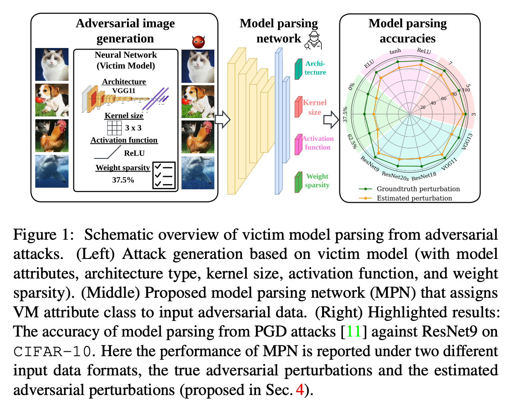

# [Can Adversarial Examples Be Parsed to Reveal Victim Model Information?](https://arxiv.org/pdf/2303.07474.pdf)

Numerous adversarial attack methods have been developed to generate imperceptible image perturbations that can cause erroneous predictions of state-of-the-art machine learning (ML) models, in particular, deep neural networks (DNNs). Despite intense research on adversarial attacks, little effort was made to uncover 'arcana' carried in adversarial attacks. In this work, we ask whether it is possible to infer data-agnostic victim model (VM) information (i.e., characteristics of the ML model or DNN used to generate adversarial attacks) from data-specific adversarial instances. We call this 'model parsing of adversarial attacks' - a task to uncover 'arcana' in terms of the concealed VM information in attacks. We approach model parsing via supervised learning, which correctly assigns classes of VM's model attributes (in terms of architecture type, kernel size, activation function, and weight sparsity) to an attack instance generated from this VM. We collect a dataset of adversarial attacks across 7 attack types generated from 135 victim models (configured by 5 architecture types, 3 kernel size setups, 3 activation function types, and 3 weight sparsity ratios). We show that a simple, supervised model parsing network (MPN) is able to infer VM attributes from unseen adversarial attacks if their attack settings are consistent with the training setting (i.e., in-distribution generalization assessment). We also provide extensive experiments to justify the feasibility of VM parsing from adversarial attacks, and the influence of training and evaluation factors in the parsing performance (e.g., generalization challenge raised in out-of-distribution evaluation). We further demonstrate how the proposed MPN can be used to uncover the source VM attributes from transfer attacks, and shed light on a potential connection between model parsing and attack transferability.



## Prepairation

Change the path related arguments in [path.py](./global_args/path.py)

### TinyImageNet Preparation
```
cd TinyImageNet
bash run.sh
```

### Pretrained DnCNN download
The pretrained DnCNN model is in [GoogleDrive](https://drive.google.com/file/d/1xZCmviKXxULit0dEyekhXs32waEc00Qa/view).

## Pipeline

### Train victim model
```bash
python run.py --stage 0 --thread 3 --gpus 0,1,2,3,4,5,6,7
```

### Get attack images
```bash
python run.py --stage 1 --thread 3 --gpus 0,1,2,3,4,5,6,7
```

### Aggregate datas
```bash
python grep_data.py # for each attack strength
python grep_class_data.py # for mixed datasets
```

### Train parsing model
```bash
python run.py --stage 2 --thread 3 --gpus 0,1,2,3,4,5,6,7
```

### Evaluate parsing model
```bash
python run.py --stage 3 --thread 20 --gpus 0,1,2,3,4,5,6,7
```

### Train and Evaluate parsing model with denoiser
```bash
python run.py --stage 2 --thread 3 --gpus 0,1,2,3,4,5,6,7 --denoise
python run.py --stage 3 --thread 5 --gpus 0,1,2,3,4,5,6,7 --denoise
```

## Optional arguments in run.py
```
--stage STAGE    To decide which part of commands to execute. (1, 2, 3)
--gpus GPUS      Run on which gpus. e.g.: --gpus 0,1,2,3
--thread THREAD  Number of commands running parallel in one gpu.
--denoise        Using denoiser when training attribute models. 
--debug          Generate commands without executing if tagged.
```

## citation
```
@article{yao2023can,
  title={Can Adversarial Examples Be Parsed to Reveal Victim Model Information?},
  author={Yao, Yuguang and Liu, Jiancheng and Gong, Yifan and Liu, Xiaoming and Wang, Yanzhi and Lin, Xue and Liu, Sijia},
  journal={arXiv preprint arXiv:2303.07474},
  year={2023}
}
```
